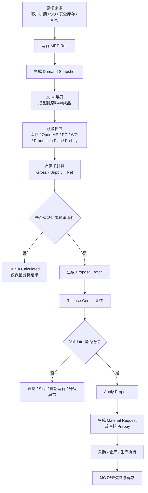
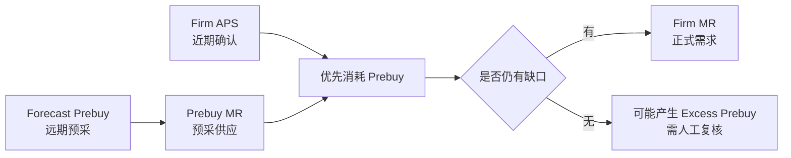

# 《MRP / MC 岗位操作手册》

> 适用系统：ERPNext + Injection MRP  
> 文件定位：MC 岗位日常操作手册、异常处理手册、培训资料、ISO 体系岗位作业文件  
> 目标读者：MC、PMC、采购、仓库、生产计划、工程/BOM 维护、部门主管、IT/系统管理员  
> 当前代码分析日期：2026-04-27  

## 文档目录

1. 代码库识别对象清单
2. 待确认事项清单
3. 文件控制信息
4. 手册目的
5. 适用范围
6. 术语和定义
7. 角色与职责
8. MRP 业务总览
9. 系统菜单与功能入口
10. 主数据前置条件
11. MC 日常工作流程
12. 标准操作流程 SOP
13. 字段说明大全
14. 状态说明
15. 报表与查询指南
16. 异常处理手册
17. 特殊业务场景处理
18. 权限与职责边界
19. 单据修改、取消与审计要求
20. 数据准确性与风险控制
21. KPI 与管理报表建议
22. 培训与考核
23. 附录
24. Codex 分析来源摘要

## 1. 代码库识别对象清单

本章节为本手册的分析依据。以下内容来自当前代码库与本地 ERPNext 标准 DocType 文件；未在代码库或标准配置中确认的事项，统一标注为“需确认”。

### 1.1 系统版本与模块路径

| 项目 | 当前识别结果 | 说明 |
| --- | --- | --- |
| 自定义 App | `injection_mrp` | 当前仓库路径为 `apps/injection_mrp`。 |
| 自定义模块 | Injection MRP | Workspace 名称为 `Injection MRP`。 |
| 依赖 App | `erpnext`、`injection_aps` | 在 `hooks.py` 中声明。 |
| 本地 bench ERPNext 版本 | ERPNext 16.14.0、Frappe 16.16.0 | 当前本地环境显示为 v16。生产环境如为 v15，需系统管理员确认。 |
| 当前 App 版本 | `injection_mrp 0.0.1` | 当前本地分支 `main`，最后识别提交 `dc9d83e`。 |
| 业务版本 | 需确认 | ISO 文件版本由公司文件管理员维护。 |

### 1.2 自定义 DocType 清单

| DocType | 业务用途 | 是否给 MC 直接使用 | 关键状态/字段 |
| --- | --- | --- | --- |
| MRP Settings | MRP 参数设置，例如计划周期、围栏、预采是否允许生成 MR、Production Plan 是否纳入供需 | 主管/管理员使用，MC 通常只查看 | `firm_horizon_days`、`prebuy_horizon_days`、`firm_fence_days`、`forecast_skip_firm_fence`、`allow_prebuy_material_request` |
| MRP Supply Rule | 维护物料供应方式、采购约束、供应商、调拨仓库等 | MC 可查看，授权人员维护 | `supply_mode`、`material_request_type`、`supplier`、`min_order_qty`、`order_multiple_qty`、`supplier_lead_time_days` |
| MRP Run | 一次 MRP 运算记录 | MC 日常查看和发起运算 | `run_type`、`status`、`planning_date`、`horizon_end`、`proposal_batch`、`error_message` |
| MRP Demand Snapshot | 需求快照，记录本次 MRP 采集到的需求来源 | MC 查看需求来源 | `demand_type`、`source_name`、`item_code`、`required_date`、`demand_qty` |
| MRP Requirement Line | 物料需求明细，展示 BOM 展开、库存、在途、预采抵扣和净需求 | MC 重点使用 | `gross_qty`、`available_qty`、`open_mr_qty`、`open_po_qty`、`prebuy_consumed_qty`、`net_qty` |
| MRP Pegging Line | 供需匹配明细，说明一笔需求由哪笔库存/MR/PO/WO/预采满足 | MC、采购、仓库查看 | `supply_type`、`supply_qty`、`expected_arrival_date`、`adjustment_action`、`warning_category` |
| MRP Rolling Balance Line | 滚动库存余额，按日期/周显示预计结余 | MC 分析欠料时间轴 | `opening_qty`、`demand_qty`、`supply_qty`、`projected_qty`、`shortage_qty` |
| MRP Shortage Alert | 欠料预警汇总 | MC 每日重点查看 | `warning_level`、`first_shortage_date`、`shortage_qty`、`latest_order_date` |
| MRP Proposal Batch | MRP 建议批次，释放后生成 Material Request 或消耗预采 | MC/主管按权限释放 | `status`、`proposal_type`、`material_request_count`、`validation_message` |
| MRP Proposal Item | 建议批次明细子表 | 通过 Release Center 操作 | `action`、`commitment_type`、`qty`、`schedule_date`、`material_request_type` |
| MRP Exception Log | MRP 异常日志 | MC 每日查看、跟进、关闭 | `severity`、`category`、`resolution_status`、`message` |

### 1.3 自定义字段识别

系统在 ERPNext 标准单据上增加了 MRP 追溯字段：

| 标准 DocType | 自定义字段 | 业务含义 |
| --- | --- | --- |
| Material Request | `custom_mrp_run` | 该 MR 来源于哪一次 MRP 运算。 |
| Material Request | `custom_mrp_requirement` | 该 MR 对应哪条 MRP 物料需求。 |
| Material Request | `custom_mrp_commitment_type` | MR 是 `Prebuy` 预采，还是 `Firm` 正式需求。 |
| Material Request | `custom_mrp_consumed_qty` | 预采被 APS 正式需求消耗的数量。 |
| Material Request | `custom_mrp_remaining_qty` | 预采剩余可用数量。 |
| Material Request | `custom_aps_run`、`custom_aps_result` | 追溯到 APS 运算和 APS 结果。 |
| Material Request Item | 上述字段 + `custom_mrp_supplier`、`custom_mrp_supplier_quotation`、`custom_mrp_item_price`、`custom_mrp_estimated_rate`、`custom_mrp_estimated_amount`、`custom_mrp_procurement_summary` | 用于采购参考、报价追溯和释放后审计。 |

### 1.4 自定义页面与入口

| 页面 | 路径 | 主要用途 | 主要按钮/动作 |
| --- | --- | --- | --- |
| MRP Run Console | `Injection MRP > MRP Run Console` | 发起 FC 预采或 APS MRP，查看运算状态和 Run 对比 | `Forecast Prebuy`、`Firm APS`、点击 Run 查看对比 |
| MRP Demand Console | `Injection MRP > MRP Demand Console` | 查看本次 MRP 采集到的需求来源 | 筛选、导出 |
| MRP Material Workbench | `Injection MRP > MRP Material Workbench` | 查看物料需求、BOM 展开、库存/在途抵扣、欠料与建议 | 点击行查看明细、导出 |
| MRP Pegging Detail | `Injection MRP > MRP Pegging Detail` | 查看需求与供应的逐笔匹配 | 筛选、导出 |
| MRP Shortage Timeline | `Injection MRP > MRP Shortage Timeline` | 查看欠料预警和滚动余额 | 导出欠料、导出 Rolling Balance |
| MRP Release Center | `Injection MRP > MRP Release Center` | 复核建议批次、调整建议行、释放生成 MR 或消耗预采 | `Validate`、`Save Changes`、`Apply Proposal`、`Add Row`、`Skip` |

### 1.5 API、后台任务与按钮逻辑

| 接口/动作 | 业务用途 | 权限要求 |
| --- | --- | --- |
| `enqueue_forecast_prebuy` | 后台提交远期预采 MRP 运算 | `System Manager`、`MPLM`、`MPLP` |
| `enqueue_firm_aps_mrp` | 后台提交 APS 确认 MRP 运算 | `System Manager`、`MPLM`、`MPLP` |
| `enqueue_recalculate_mrp_run` | 后台重算一张 MRP Run | `System Manager`、`MPLM`、`MPLP` |
| `apply_proposal_batch` | 应用建议批次，生成 MR 或消耗预采 | `System Manager`、`MPLM`、`MPLP` |
| `validate_proposal_batch_for_release` | 释放前实时复核 | `System Manager`、`MPLM`、`MPLP` |
| `save_proposal_batch_items` | 保存建议行调整 | `System Manager`、`MPLM`、`MPLP` |
| `get_*_data` | 页面查询数据 | MRP 读权限角色 |
| `export_table_xlsx` | 导出表格 Excel | MRP 读权限角色 |

后台任务使用 Frappe 队列 `long`，单个 MRP 任务超时配置为 3600 秒。前端提交任务后会显示 `Queued` 或 `Running`，并自动刷新直到成功或失败。

### 1.6 权限与角色识别

| 角色 | 自定义 MRP 权限倾向 | 说明 |
| --- | --- | --- |
| System Manager | 管理、维护、释放 | 可维护设置、规则、运行和释放。 |
| MPLM | 管理/主管类 MRP 权限 | 可维护设置、规则、运行和释放。 |
| MPLP | 操作类 MRP 权限 | 可运行 MRP、编辑建议、释放建议；对部分配置只读或受限。 |
| GMC、PMC | 主要查看 | 可查看页面和数据，用于协同。 |
| Purchase Manager/User | 主要查看 | 可查看采购相关 MRP 数据和标准 MR/PO 连接点。 |
| Manufacturing Manager/User | 主要查看 | 可查看生产和工单相关数据。 |
| Stock Manager/User | 主要查看 | 可查看库存与仓库相关数据。 |
| Sales Manager/User | 主要查看 | 可查看需求来源与销售订单相关数据。 |

注意：ERPNext 标准单据的提交、取消、修订权限还受标准 Role Permission Manager、Workflow 和公司现场权限配置影响，需系统管理员确认。

### 1.7 工作流、报表、脚本和定时任务识别

| 类型 | 当前代码库识别结果 | 说明 |
| --- | --- | --- |
| 自定义 Workflow | 未识别到仓库内 Workflow 配置 | 若生产站点在数据库中单独配置 Workflow，需系统管理员补充。 |
| Server Script | 未识别到仓库内 Server Script | 站点级 Server Script 需系统管理员确认。 |
| Client Script | 未识别到独立 Client Script DocType | 代码中有页面 JS 和 DocType JS：`MRP Run`、`MRP Proposal Batch`。 |
| Query Report / Script Report | 未识别到独立报表文件 | 当前主要以自定义 Page 和列表/导出承担报表用途。 |
| Scheduler Event | 未识别到定时任务 | MRP 由用户手工发起后台任务，不是定时自动运行。 |
| 数据索引补丁 | 已识别 `add_mrp_indexes.py` | 为需求、需求行、追溯、欠料、建议批次、异常、供应规则等关键字段建索引。 |

### 1.8 ERPNext 标准连接点

| ERPNext 标准对象 | MRP 如何使用 | MC 需要关注 |
| --- | --- | --- |
| Item | 读取物料名称、库存单位、默认仓库、默认 BOM、采购属性、Lead Time、安全库存、MOQ、采购 UOM、客供/外协标识 | Item 主数据错误会直接导致 MRP 错算。 |
| BOM / BOM Item | 读取默认、已提交、Active BOM；按 BOM 数量、损耗、多层子 BOM 展开需求 | BOM 未提交、非 Active、非默认或用量错误，会导致缺料或重复需求。 |
| Customer Delivery Schedule | Forecast Prebuy 的客户排期需求来源 | 需确认贵司是否启用此自定义/扩展单据。 |
| Sales Order | Forecast Prebuy 的正式销售订单需求来源，并用于冲销 Forecast | 仅读取已提交且未关闭/取消的 SO 未交数量。 |
| APS Planning Run / APS Schedule Result | Firm APS 的需求来源 | 只读取状态为 Approved、Work Order Proposed、Shift Proposed、Applied 的 APS 结果，数量取 scheduled_qty。 |
| Production Plan | 可作为供应，设置开启后也可作为需求 | 默认作为供应开启；作为需求默认关闭。需确认业务是否启用。 |
| Work Order | 作为开放供应抵扣 | 未完成 WO 会减少新的需求建议。 |
| Material Request | 作为开放 MR 供应；MRP 释放后也生成 MR | 预采 MR 用 `Prebuy` 标识，Firm APS 可消耗预采。 |
| Purchase Order | 作为开放 PO 供应 | 已提交、未关闭/取消、未完全收货 PO 会抵扣需求。 |
| Warehouse / Bin | 读取仓库公司和实际库存 `actual_qty` | 仓库错误会导致库存抵扣错误。 |
| Supplier / Supplier Quotation / Item Price / Item Supplier | 作为供应商、报价、采购倍量和前置时间参考 | 仅作为 MR 建议参考，不直接生成 PO。 |
| UOM | 用于 Item、BOM、MR/PO 的单位转换 | 销售订单、MR、PO 按 stock_qty/conversion_factor 统一到库存单位。 |

### 1.9 已识别状态与短码

| 对象 | 状态/短码 | 业务含义 |
| --- | --- | --- |
| MRP Run | Draft、Queued、Running、Calculated、Proposal Generated、Released、Failed、Closed、Cancelled | 运算生命周期。 |
| MRP Proposal Batch | Draft、Ready、Applied、Superseded、Expired、Rejected、Closed | 建议批次生命周期。只有 Ready 可释放。 |
| MRP Proposal Item | Pending、Applied、Skipped、Exception | 建议行处理状态。 |
| MRP Requirement Line | Draft、Ready、Exception、Released、Consumed、Closed | 需求行处理状态。 |
| MRP Shortage Alert | Open、Reviewed、Closed | 欠料预警处理状态。 |
| MRP Exception Log | Open、Ignored、Resolved | 异常处理状态。 |
| Warning Level | None、Info、Warning、Critical | 预警等级。Critical 表示硬欠料或严重滞后。 |
| Adjustment Action | No Adjustment、Expedite、Delay、Cancel、Review、Create Material Request、Consume Prebuy、Review Excess Prebuy | 系统建议动作。 |

短码图例在页面表格工具栏显示，例如 `APS = Firm APS`、`PB = Prebuy`、`CRT = Critical`、`CMR = Create Material Request`。短码只显示当前页实际出现的状态/动作。

### 1.10 已识别报错与异常消息

| 报错/异常 | 触发条件 | MC 处理建议 |
| --- | --- | --- |
| `Company is required for MRP.` | 新建 MRP Run 时没有公司 | 补公司；如默认公司缺失，联系系统管理员。 |
| `MRP Run ... already has applied proposal batches and cannot be recalculated.` | 已释放的 Run 被重算 | 禁止重算；新建 Run 重新计算，并保留旧记录审计。 |
| `Only Ready proposal batches can be applied.` | 非 Ready 批次被释放 | 查看是否 Superseded/Applied/Closed；不要释放旧批次。 |
| `Proposal batch validation failed...` | Apply 前实时复核不通过 | 打开 Release Center 查看 Validation 信息，按行复核。 |
| `Prebuy Material Request generation is disabled in MRP Settings.` | 设置禁用预采 MR，但尝试释放 FC 预采 | 主管确认是否允许预采；需要时由 MPLM/管理员调整设置。 |
| `Only Draft or Ready proposal batches can be edited.` | 编辑已 Applied/Superseded/Closed 批次 | 不允许修改；需新跑 MRP 或按异常流程处理。 |
| `Invalid proposal item payload.` | 页面或接口传入建议行格式不正确 | 刷新页面重试；仍失败联系 IT。 |
| `MRP Proposal Batch ... was not found.` | 批次不存在或已删除 | 刷新页面；确认链接是否正确。 |
| `Forecast Prebuy proposals can only release Prebuy commitments.` | FC 预采建议被改成 Firm 后释放 | 禁止；恢复 Prebuy 或重新跑 APS。 |
| `Firm APS material request proposals must release Firm commitments.` | APS MR 建议被改成 Prebuy 后释放 | 禁止；确认建议来源。 |
| `Consume Prebuy rows must keep Prebuy commitment type.` | 消耗预采行承诺类型被改错 | 恢复 Prebuy。 |
| `Current shortage ... is lower than proposal qty ...` | Apply 前发现现有库存/MR/PO/WO 已覆盖部分建议 | 阻止释放，需重新跑 MRP 或调整/Skip 行。 |
| `Available prebuy qty ... is lower than consume qty ...` | APS 消耗预采时可用预采不足 | 阻止释放，需重新跑 MRP 或确认预采 MR 状态。 |
| `Item ... is not a subcontracted item.` | 以 Subcontracting 类型释放非外协物料 | 需工程/主数据维护 Item 标识或改供应方式。 |
| `Item ... is not a customer provided item.` | 以 Customer Provided 类型释放非客供物料 | 需工程/主数据维护 Item 标识或改供应方式。 |
| `Source Warehouse is required for Material Transfer item ...` | 调拨类 MR 缺来源仓 | 补来源仓库后再释放。 |
| `Invalid Demand Item` | 需求来源中的物料值找不到 ERPNext Item | 修正源单据 Item；若 Item Code 与 Doc Name 不一致，系统会尝试按 `item_code` 解析，仍失败则需主数据处理。 |
| `Missing BOM` | 应该自产/外协的物料没有已提交、Active 的 BOM | 联系工程/BOM 负责人维护 BOM 后重新运行。 |
| `Missing Lead Time` | 物料未维护 Lead Time | 维护 Item Lead Time 或供应规则供应商 Lead Time。 |
| `Late Supply` | 现有供应到货晚于物料需求日期 | 联系采购/生产催期。 |
| `Early Supply` | 现有供应过早到货 | 评估延期、仓储风险或保留。 |
| `Excess Prebuy` | APS 消耗后仍有预采剩余 | 人工判断保留、延期、取消或转用。 |
| `Past Due Order` | 建议下单日期早于今天 | 已经滞后，需紧急处理。 |
| `No rows available to export.` | 当前表格无数据但点击导出 | 先确认筛选条件或运行 MRP。 |
| `Not permitted for Injection MRP.` | 当前用户没有权限 | 联系主管或系统管理员申请权限。 |

## 2. 待确认事项清单

| 序号 | 待确认事项 | 责任建议 |
| --- | --- | --- |
| 1 | 生产环境 ERPNext/Frappe 版本是 v15、v16 还是混合环境 | IT/系统管理员 |
| 2 | ISO 文件编号、正式版本号、生效日期、审核人、批准人 | 文件管理员/部门主管 |
| 3 | MC 岗位实际角色是 `MPLP`、`PMC` 还是另有角色名称 | 系统管理员/部门主管 |
| 4 | 是否启用 `Customer Delivery Schedule` 作为客户排期来源 | 销售/PMC/IT |
| 5 | `Forecast Prebuy` 是否允许生成并提交 MR，是否需要主管审批 | 主管/采购/财务 |
| 6 | `auto_submit_material_request` 是否允许开启 | 主管/采购/系统管理员 |
| 7 | Production Plan 在贵司是作为需求、供应，还是仅参考 | PMC/生产计划 |
| 8 | Material Request 到 Purchase Order 的责任边界和审批流 | 采购/主管 |
| 9 | Work Order 由谁创建、何时创建、是否由 Production Plan 自动生成 | 生产计划/生产主管 |
| 10 | 预采超额的业务处理规则：保留、取消、转用、延期的审批人 | 主管/采购/财务 |
| 11 | 是否存在站点级 Workflow、Server Script、Client Script | 系统管理员 |
| 12 | 截图位置需由实施人员补齐 | 文档维护人 |

## 3. 文件控制信息

| 项目 | 内容 |
| --- | --- |
| 文件名称 | MRP / MC 岗位操作手册 |
| 文件编号 | SOP-MRP-MC-001 |
| 版本号 | V1.0 草案 |
| 生效日期 | 需确认 |
| 编写部门 | 需确认，建议为 PMC/计划部 |
| 适用部门 | MC、PMC、采购、仓库、生产、工程/BOM、IT |
| 文件拥有者 | 需确认，建议为 MC 主管 |
| 审核人 | 需确认 |
| 批准人 | 需确认 |
| 保密级别 | 内部使用 |

版本变更记录：

| 版本 | 日期 | 变更内容 | 编写/修订 | 审核 | 批准 |
| --- | --- | --- | --- | --- | --- |
| V1.0 草案 | 2026-04-27 | 基于当前代码库生成第一版 SOP | Codex | 需确认 | 需确认 |

## 4. 手册目的

本手册用于指导 MC 同事在 ERPNext 的 Injection MRP 模块中完成日常物料计划工作，包括需求采集、BOM 物料展开、库存与在途抵扣、欠料识别、采购/生产需求建议、预采与 APS 正式需求衔接、Material Request 释放、异常跟进和跨部门协作。

本手册不是开发文档。MC 不需要理解代码，只需要按本手册判断：什么时候运行 MRP、看哪些页面、如何识别异常、哪些动作可以自己处理、哪些动作必须升级给主管、采购、仓库、生产、工程或 IT。

## 5. 适用范围

本手册适用于以下业务场景：

| 场景 | 是否适用 | 说明 |
| --- | --- | --- |
| 客户排期或预测需求转预采需求 | 适用 | 使用 Forecast Prebuy。 |
| 销售订单未交需求转物料需求 | 适用 | FC 运算会读取 SO 并冲销 Forecast。 |
| APS 确认排程转正式物料需求 | 适用 | 使用 Firm APS。 |
| BOM 多层展开 | 适用 | 按默认已提交 Active BOM 展开。 |
| 原料、包材、半成品、外协、客供、调拨需求分析 | 适用 | 由供应方式和 MR Type 控制。 |
| Material Request 生成和跟进 | 适用 | MRP 只生成 MR，不直接生成 PO。 |
| Work Order 生成 | 部分适用 | MRP 可生成 Manufacture 类型 MR；WO 创建流程仍按 ERPNext/生产计划规则执行。 |
| Purchase Order 创建 | 不直接适用 | PO 由采购从 MR 或采购流程创建，MRP 只作为供应抵扣和追溯。 |
| 库存盘点、财务核算 | 不直接适用 | MRP 会引用库存数据，但不替代库存/财务流程。 |
| 自动取消 MR/PO/WO | 不适用 | 系统只提示异常，不自动取消已释放单据。 |

## 6. 术语和定义

| 术语 | 业务解释 |
| --- | --- |
| MRP | 物料需求计划。根据需求、BOM、库存、在途供应和提前期，计算还需要准备多少物料以及何时下单。 |
| MC | 物料控制岗位。负责确认物料需求、跟进缺料、推动采购/仓库/生产处理异常。 |
| FC / Forecast Prebuy | 远期预采。基于客户排期、SO、安全库存等远期需求提前备料，结果为 `Prebuy`。 |
| APS / Firm APS | APS 确认需求。基于已确认 APS 排程计算正式物料需求，结果为 `Firm`。 |
| BOM | 物料清单。定义生产一个成品/半成品需要哪些子件、数量、损耗和子 BOM。 |
| Item | ERPNext 物料主数据。MRP 的所有需求和供应都必须能匹配到 Item。 |
| Production Plan | 生产计划。ERPNext 标准生产计划单据，可作为供应或可选需求。 |
| Work Order | 工单。生产某个物料的执行单，未完成数量会作为供应抵扣。 |
| Material Request | 物料申请。MRP 释放后主要生成的单据，采购/仓库/生产根据 MR 继续处理。 |
| Purchase Order | 采购订单。已提交未收货的 PO 会作为供应抵扣。 |
| Projected Qty | ERPNext 预计库存，通常考虑库存、订单、预留、计划等因素。MRP 自定义页面另有 Rolling Balance 预计结余。 |
| Actual Qty | 实际库存数量，来自 Bin。 |
| Reserved Qty | 已预留库存数量，常见于销售/生产占用。 |
| Ordered Qty | 已订购数量，例如 MR/PO 尚未完成的供应数量。 |
| Planned Qty | 已计划数量，通常来自生产计划或计划供应。 |
| Lead Time | 提前期。从下单/释放到物料可用需要的天数。 |
| Safety Stock | 安全库存。低于安全库存会产生预警，低于 0 为硬欠料。 |
| Warehouse | 仓库。MRP 按物料 + 仓库计算，不同仓库不能随意合并。 |
| Shortage | 欠料。预计结余不足，可能导致生产或交付延迟。 |
| Backflush | 倒冲发料。生产后按 BOM 自动扣料，具体是否使用由生产/仓库流程决定。 |
| Submit | 提交。ERPNext 标准单据从草稿变为正式单据。 |
| Cancel | 取消。已提交单据作废，保留审计记录。 |
| Amend | 修订。取消后复制产生新版本继续使用。 |
| Draft / Submitted / Cancelled | 草稿/已提交/已取消。ERPNext 标准 docstatus 状态。 |
| Superseded | 已被新 Run 覆盖。旧建议不能释放。 |
| Expired | 已过期。当前代码支持该状态，但自动过期规则需确认。 |

## 7. 角色与职责

| 角色 | 主要职责 | 在系统中的常用操作 | 需要确认/审批的事项 | 异常时应联系谁 |
| --- | --- | --- | --- | --- |
| MC | 运行 MRP、检查需求、识别缺料、释放 MR 建议、跟进异常 | Run Console、Material Workbench、Shortage Timeline、Release Center | 释放预采、大额/异常 MR、修改建议数量、Skip 建议 | 主管、采购、仓库、工程、IT |
| PMC/生产计划 | 确认生产排程、APS 状态、生产计划变化 | 查看 APS、Production Plan、WO、MRP 页面 | 插单、改期、停线、需求优先级 | MC、生产主管 |
| 采购 | 接收 MR、转 PO、跟进供应商交期和价格 | MR、PO、供应商报价、Item Price、MRP Pegging | 换供应商、加急费、取消 PO | MC、采购主管 |
| 仓库 | 确认库存、收货、发料、调拨 | Stock Ledger、Bin、Stock Entry、MR/PO 收货 | 库存差异、负库存、盘点调整 | MC、仓库主管 |
| 工程/BOM 维护 | 维护 Item、BOM、替代料、损耗 | Item、BOM、Routing/Operation | BOM 变更、临时替代、停用旧料 | MC、工程主管 |
| 财务/成本 | 关注超额采购、呆滞、成本影响 | 采购价格、库存金额、异常清单 | 预采超额、取消损失、呆滞风险 | 主管、采购 |
| 系统管理员/IT | 权限、配置、报错排查、脚本/工作流确认 | Role、Workflow、日志、队列、Bench | 权限变更、系统异常、数据修复 | MC 主管 |
| 部门主管 | 审批关键计划和异常处理 | 审核导出报表、审批异常 | 预采释放、加急、取消、改期、跨部门争议 | 各职能负责人 |

## 8. MRP 业务总览

Injection MRP 当前采用“两层计划口径”：

| 口径 | 何时运行 | 数据来源 | 结果用途 |
| --- | --- | --- | --- |
| Forecast Prebuy | APS 尚未完全确认，但已有客户排期、SO 或安全库存风险，需要提前备料 | Customer Delivery Schedule、Sales Order、安全库存、可选 Production Plan | 生成 `Prebuy` 预采建议，可释放预采 MR。 |
| Firm APS | APS 已确认，需要转成近期正式采购/生产需求 | APS Schedule Result | 优先消耗已有 Prebuy，剩余缺口生成 `Firm` 正式 MR 建议。 |

整体流程：

FC 与 APS 的关系：

必须理解的原则：

- 必须：同一需求范围内，最新 Ready 批次优先，旧 Ready 批次可能被标记为 Superseded。
- 必须：只有 `Ready` 的 Proposal Batch 可以 Apply。
- 必须：已 Applied 的 Proposal Batch 不允许重算对应 MRP Run。
- 禁止：把 FC 预采建议手工改成 Firm 后释放。
- 禁止：把 APS 正式 MR 建议手工改成 Prebuy 后释放。
- 建议：FC 只用于远期备料，APS 作为近期执行主口径。
- 需主管确认：预采是否释放、超额预采是否保留/取消/转用。

## 9. 系统菜单与功能入口

| 功能名称 | 路径 | 用途 | 使用频率 | 操作人 | 注意事项 |
| --- | --- | --- | --- | --- | --- |
| Injection MRP Workspace | ERPNext 桌面 > Injection MRP | MRP 模块总入口 | 每日 | MC | 若看不到入口，检查角色权限。 |
| MRP Run Console | Injection MRP > MRP Run Console | 发起 MRP、查看运算状态、查看差异 | 每日/按需 | MC | 新建/重算为后台任务，等待状态完成。 |
| MRP Demand Console | Injection MRP > MRP Demand Console | 核对需求来源 | 每日/按需 | MC/销售/PMC | 若需求少或多，先查这里。 |
| MRP Material Workbench | Injection MRP > MRP Material Workbench | 核对物料需求、净需求、BOM、供应抵扣 | 每日 | MC | 这是 MC 主工作台。 |
| MRP Shortage Timeline | Injection MRP > MRP Shortage Timeline | 查看欠料日期、数量和最晚下单日 | 每日 | MC/采购 | Critical 优先处理。 |
| MRP Pegging Detail | Injection MRP > MRP Pegging Detail | 查看需求由哪些供应满足 | 每日/按需 | MC/采购 | 用于解释“为什么仍缺料/为什么没缺”。 |
| MRP Release Center | Injection MRP > MRP Release Center | 复核和释放建议批次 | 每日/按需 | MC/主管 | Apply 前必须 Validate。 |
| MRP Settings | Injection MRP > MRP Settings | 维护计划周期、围栏、MR 自动提交、按供应方式默认仓库等 | 低频 | MPLM/管理员 | 不建议普通 MC 修改；采购原材料仓库优先在此维护。 |
| MRP Supply Rule | Injection MRP > MRP Supply Rule | 维护供应方式、供应商、MOQ/倍量 | 按需 | MPLM/MPLP | 修改会影响后续 MRP 结果。 |

截图占位：

- 【截图：Injection MRP Workspace】
- 【截图：MRP Run Console】
- 【截图：MRP Material Workbench】
- 【截图：MRP Release Center】

## 10. 主数据前置条件

MRP 计算准确性高度依赖主数据。运行前必须确保以下数据正确。

| 检查项目 | 为什么重要 | 谁负责维护 | 检查方法 | 常见错误 | 影响 |
| --- | --- | --- | --- | --- | --- |
| Item Code / Item Name | 所有需求必须匹配 ERPNext Item | 工程/主数据 | Item 列表查询 | 源单据填了非 Item 编码 | 需求被过滤并记录 Invalid Demand Item |
| Stock UOM | 统一数量口径 | 工程/主数据 | Item > Stock UOM | UOM 与 SO/MR/PO 不一致 | 数量换算错误 |
| Default Warehouse | 无仓库需求可用默认仓 | 工程/仓库 | Item > Default Warehouse | 未维护或维护错仓 | 库存抵扣错 |
| MRP 供应方式默认仓库 | 决定采购/制造/调拨等建议默认进入哪个仓 | MPLM/管理员 | MRP Settings > Warehouse Defaults by Supply Mode | 采购物料默认仓维护成成品仓 | 原材料需求、MR 仓库错误 |
| Lead Time Days | 计算建议下单日 | 工程/采购 | Item > Lead Time in days | 未维护 | Missing Lead Time、下单日不可靠 |
| Safety Stock | 触发安全库存补货 | MC/主管/工程 | Item > Safety Stock | 过高或过低 | 过量或缺料 |
| Default BOM | BOM 展开的入口 | 工程/BOM | Item > Default BOM 或 BOM 列表 | 无默认 BOM | Missing BOM |
| BOM 状态 | 只有已提交、Active、Default BOM 才可靠 | 工程/BOM | BOM > docstatus/is_active/is_default | 草稿/停用/非默认 | 需求错算或缺 BOM |
| BOM Qty / Scrap | 决定物料用量 | 工程/BOM | BOM Item 行 | 用量、损耗错误 | 缺料或过采 |
| BOM Item UOM / Stock Qty | 决定换算后的库存单位数量 | 工程/BOM | BOM Item | UOM 换算错误 | 用量错误 |
| Supply Mode | 决定采购/自产/外协/客供/调拨 | MC/工程/采购 | MRP Supply Rule 或 Item 标识 | 采购物料被判自产 | 错误生成 MR Type |
| Supplier / Item Supplier | 采购建议参考供应商 | 采购 | Item Default、Item Supplier、Supply Rule | 未维护 | Missing Supplier |
| MOQ / Order Multiple | 决定建议下单量是否向上取整 | 采购 | Item、Item Price、Supply Rule | 包装倍量缺失 | 采购数量不符合供应商规则 |
| Warehouse Company | MRP 按公司过滤仓库库存 | 仓库/IT | Warehouse | 仓库公司错误 | 库存不被抵扣 |
| Open MR/PO/WO 状态 | 未关闭单据会作为供应抵扣 | MC/采购/生产 | MR/PO/WO 列表 | 已取消但未更新、已完成未关闭 | 重复或漏算 |

## 11. MC 日常工作流程

### 11.1 每日工作

| 工作项 | 目的 | 操作路径 | 操作步骤 | 判断标准 | 输出结果 | 注意事项 |
| --- | --- | --- | --- | --- | --- | --- |
| 查看最新 MRP Run | 确认昨天/今天运算是否成功 | MRP Run Console | 查看状态、错误、需求数、异常数 | 状态为 Calculated/Proposal Generated/Released 为正常；Failed 需处理 | 运算状态记录 | Queued/Running 等待刷新。 |
| 查看欠料 | 识别生产/交付风险 | Shortage Timeline | 筛选 Open + Critical/Warning | Critical 优先，Latest Order Date 早于今天为紧急 | 欠料清单 | 导出发给采购/生产。 |
| 查看物料工作台 | 分析净需求与供应抵扣 | Material Workbench | 筛选最新 Run，点击行查看明细 | Net > 0 或 Warning Count > 0 需跟进 | 需求分析记录 | 重点看 BOM、库存、MR、PO、WO、Prebuy。 |
| 检查 Release Center | 复核可释放建议 | Release Center | 筛选 Ready，打开批次，Validate | Validate 通过才允许 Apply | MR 或预采消耗 | Superseded 不允许释放。 |
| 跟进 MR/PO | 确认释放后是否执行 | ERPNext MR/PO 列表 | 筛选 MRP Run、MR 状态、PO 交期 | 未下单或延期需提醒采购 | 跟进记录 | MRP 不自动生成 PO。 |
| 处理异常日志 | 关闭主数据/计划异常 | MRP Exception Log | 筛选 Open | Missing BOM、Missing Lead Time、Late Supply 优先 | 异常处理记录 | 需跨部门确认后更新状态。 |

### 11.2 每周工作

| 工作项 | 目的 | 操作建议 |
| --- | --- | --- |
| 汇总未来 N 周物料风险 | 让采购提前处理长周期物料 | 导出 Shortage Timeline 和 Material Workbench，按供应商、物料组、最晚下单日汇总。 |
| 检查长周期物料 | 防止临近生产才发现来不及 | 筛选 Lead Time 高、Past Due Order、Missing Lead Time。 |
| 与采购/生产会议确认风险 | 确认责任和解决日期 | 使用 Pegging Detail 说明需求与供应来源。 |
| 清理未关闭 MR/PO/WO | 避免旧单据错误抵扣供应 | 与采购/生产确认是否 Closed/Stopped/Cancelled。 |
| 检查 Superseded 批次 | 防止误释放旧建议 | Release Center 筛选 Superseded/Ready。 |

### 11.3 每月工作

| 工作项 | 目的 | 操作建议 |
| --- | --- | --- |
| 检查主数据准确性 | 降低系统性错算 | 输出 Missing BOM、Missing Lead Time、Missing Supplier 清单给责任人。 |
| 检查长期未关闭需求 | 避免重复抵扣或呆滞 | MR/PO/WO 按创建日期、状态筛选。 |
| 检查超额预采 | 控制库存和资金风险 | Firm APS 后查看 Excess Prebuy。 |
| 输出 KPI | 管理改善 | 统计短缺次数、异常关闭率、MR 及时率等。 |

### 11.4 按需工作

| 触发事件 | MC 动作 |
| --- | --- |
| 客户插单/加急 | 运行 Firm APS 或按主管要求运行 FC；检查 Critical、Past Due Order。 |
| 销售订单取消/减少 | 重新运行对应范围 MRP；查看 Excess Supply/Excess Prebuy。 |
| BOM 变更 | 工程确认后重新运行 MRP；旧 Ready 批次不可释放。 |
| 采购延期 | 查看 Pegging Detail，确认影响需求；升级给采购。 |
| 库存差异 | 仓库调整系统库存后重新运行 MRP。 |

## 12. 标准操作流程 SOP

### SOP-MRP-001：运行 Forecast Prebuy 远期预采

| 项目 | 内容 |
| --- | --- |
| 目的 | 根据远期客户排期、SO 和安全库存提前识别采购/备料风险。 |
| 适用场景 | 长周期物料、进口料、包材、客户未来排期已有但 APS 尚未确认。 |
| 触发条件 | 新客户排期、SO 增加、每周滚动计划、主管要求预采。 |
| 前置条件 | Item、BOM、仓库、Lead Time、安全库存、供应规则已维护。 |
| 操作角色 | MC 或授权计划员。 |
| 操作路径 | Injection MRP > MRP Run Console > Forecast Prebuy。 |

操作步骤：

1. 打开 `MRP Run Console`。
2. 点击 `Forecast Prebuy`。
3. 填写 `Company`，必须填写。
4. 如只算某个物料、客户、仓库，可填写 `Item`、`Customer`、`Warehouse`；不填则按范围全量计算。
5. 确认 `Planning Date`，默认当天。
6. 点击 `Queue`。
7. 等待 Run 状态从 `Queued` 到 `Running`，最终变成 `Calculated` 或 `Proposal Generated`。
8. 若状态为 `Failed`，查看 `Last Error` 并按异常处理。
9. 运算完成后，进入 `Material Workbench` 和 `Shortage Timeline` 检查结果。
10. 如需要释放预采 MR，进入 `Release Center` 复核并 Apply。

关键字段：

| 字段 | 业务含义 | 是否必填 | 填写规则 | 示例 | 填错后果 |
| --- | --- | --- | --- | --- | --- |
| Company | 计算所属公司 | 是 | 选择实际公司 | JCE | 不填会报错。 |
| Item | 限定单个物料 | 否 | 需要专项分析时填写 | FG-001 | 填错会漏算其他物料。 |
| Customer | 限定客户 | 否 | 客户专项排期时填写 | Customer A | 填错会漏算/误算。 |
| Warehouse | 限定仓库 | 否 | 仅算指定仓库时填写 | Stores | 仓库错会影响库存抵扣。 |
| Planning Date | 计划开始日期 | 否 | 通常为当天 | 2026-04-27 | 日期偏差会影响计划周期。 |

检查点：

- 必须确认 Run 状态成功完成。
- 必须确认 FC 结果的 Commitment 为 `Prebuy`。
- 建议检查 Missing BOM、Missing Lead Time、Missing Supplier。
- 预采释放前需确认是否符合公司预采审批规则。

输出结果：

- MRP Run。
- Demand Snapshot。
- Requirement Line。
- Shortage Alert。
- Proposal Batch，如有缺口。
- 预采 MR，如 Apply 后生成。

### SOP-MRP-002：运行 Firm APS 正式 MRP

| 项目 | 内容 |
| --- | --- |
| 目的 | 根据已确认 APS 排程生成近期正式物料需求，并优先消耗预采。 |
| 适用场景 | APS 已 Approved / Work Order Proposed / Shift Proposed / Applied。 |
| 触发条件 | APS 确认、生产计划变更、插单、近期生产计划滚动。 |
| 前置条件 | APS 数据已确认，BOM 和库存数据已更新。 |
| 操作角色 | MC 或授权计划员。 |
| 操作路径 | Injection MRP > MRP Run Console > Firm APS。 |

操作步骤：

1. 打开 `MRP Run Console`。
2. 点击 `Firm APS`。
3. 填写 `Company`。
4. 如只计算某个 APS Run，可选择 `APS Run`；不选则读取当前公司所有符合状态的 APS Run。
5. 可按需填写 `Item`、`Customer`、`Warehouse`。
6. 点击 `Queue`。
7. 等待 Run 完成。
8. 在 `Material Workbench` 中重点查看 `Prebuy Consumed`、`Net`、`Warnings`。
9. 在 `Release Center` 复核 APS 生成的 `Firm` 建议。
10. Apply 前必须点击 `Validate` 或确认系统 Apply 时自动复核通过。

检查点：

- APS 数量取 `scheduled_qty`，不是全部 `planned_qty`。
- 若 planned_qty 大于 scheduled_qty，系统会记录 `Unscheduled APS Quantity` 警告。
- APS 会优先消耗已有 Prebuy；只对缺口生成 Firm MR。
- 未被 APS 消耗的 Prebuy 会显示为 Excess Prebuy 或相关 Review 动作。

### SOP-MRP-003：查看并确认需求来源

| 项目 | 内容 |
| --- | --- |
| 目的 | 判断 MRP 结果是否来自正确需求。 |
| 适用场景 | 需求数量异常、漏算、多算、客户投诉、计划变更。 |
| 操作路径 | Injection MRP > MRP Demand Console。 |

操作步骤：

1. 打开 `MRP Demand Console`。
2. 选择最新 `MRP Run`。
3. 按 `Demand Type` 筛选：Forecast、Sales Order、Safety Stock、APS、Production Plan。
4. 检查 `Item`、`Customer`、`Warehouse`、`Required Date`、`Demand Qty`。
5. 点击 `Source` 跳转源单据确认。
6. 如需求不应存在，联系源单据负责人修改后重新运行 MRP。

判断标准：

- Forecast 来源应为客户排期。
- Sales Order 只应包含已提交且未关闭/取消的未交数量。
- APS 只应包含符合状态的 APS Schedule Result。
- Safety Stock 只在库存低于安全库存时产生。

### SOP-MRP-004：检查物料需求与 BOM 展开

| 项目 | 内容 |
| --- | --- |
| 目的 | 确认 MRP 算出的物料用量、仓库、日期、供应抵扣是否合理。 |
| 操作路径 | Injection MRP > MRP Material Workbench。 |

操作步骤：

1. 打开 `MRP Material Workbench`。
2. 筛选最新 `MRP Run`。
3. 优先查看 `Net > 0`、`Warning` 不为空、`First Shortage Date` 靠前的行。
4. 点击需求行，查看抽屉中的：
   - Requirement：物料、供应方式、MR Type、需求日期、建议下单日。
   - Procurement Constraints：供应商、MOQ、倍量、参考报价。
   - BOM Confirmation：BOM 状态、BOM 行、子 BOM。
   - BOM Explosion Path：多层 BOM 路径。
   - Supply Offset：库存、Open MR、Open PO、Open WO、Prebuy。
   - Pegging Detail：逐笔供应匹配。
   - Exceptions：异常。
5. 对异常行按异常处理手册处理。

检查点：

- `Gross` 是否符合 BOM 用量和需求数量。
- `Stock/MR/PO/WO/Prebuy` 抵扣是否合理。
- `Net` 是否确实需要新建供应。
- `Order Date` 是否早于今天。
- `Supply Mode` 是否符合物料属性。

### SOP-MRP-005：识别物料短缺

| 项目 | 内容 |
| --- | --- |
| 目的 | 快速找出可能影响生产/交付的缺料。 |
| 操作路径 | Injection MRP > MRP Shortage Timeline。 |

操作步骤：

1. 打开 `MRP Shortage Timeline`。
2. 筛选 `Status = Open`。
3. 优先处理 `Warning = Critical`。
4. 查看 `First Shortage Date`、`Shortage Qty`、`Latest Order Date`。
5. 点击预警行，查看受影响需求和滚动余额。
6. 导出欠料清单发送给采购/生产/主管。

判断标准：

- `Projected Qty < 0` 为硬欠料，显示 `Critical`。
- `Projected Qty < Safety Stock` 但不小于 0，为安全库存风险，显示 `Warning`。
- `Latest Order Date` 早于今天，说明理论上已经来不及，需升级。

### SOP-MRP-006：释放建议生成 Material Request

| 项目 | 内容 |
| --- | --- |
| 目的 | 将 MRP 建议转成 ERPNext Material Request，推动采购/生产/仓库执行。 |
| 操作路径 | Injection MRP > MRP Release Center。 |

操作步骤：

1. 打开 `MRP Release Center`。
2. 筛选 `Status = Ready`。
3. 点击目标 Proposal Batch。
4. 检查 `Type` 是 Forecast Prebuy 还是 Firm APS。
5. 检查每一行的 Item、Qty、Schedule Date、MR Type、Supply Mode、Commitment、Warehouse、Supplier。
6. 如需调整，修改后点击 `Save Changes`。
7. 对不应释放的行点击 `Skip`，填写或保留 Skip Reason。
8. 点击 `Validate`。
9. 若系统提示通过，点击 `Apply Proposal`。
10. Apply 后记录生成的 Material Request 编号。

必须遵守：

- 只有 Ready 批次可以释放。
- Superseded、Expired、Closed、Rejected、Applied 批次禁止释放。
- Apply 时系统会再次实时复核，复核失败会阻止释放。
- Forecast Prebuy 只能释放 Prebuy。
- Firm APS MR 建议必须释放 Firm。
- Consume Prebuy 行必须保持 Prebuy。

输出结果：

- Create Material Request 行：生成 MR。
- Consume Prebuy 行：更新预采 MR 的 consumed/remaining 数量。
- Proposal Batch 状态变为 Applied。
- MRP Run 状态变为 Released。

### SOP-MRP-007：检查和跟进采购需求

| 项目 | 内容 |
| --- | --- |
| 目的 | 确认 MRP 释放的 MR 是否被采购及时处理。 |
| 操作路径 | ERPNext > Material Request / Purchase Order。 |

操作步骤：

1. 打开 Material Request 列表。
2. 筛选 `MRP Run` 或 `MRP Commitment Type`。
3. 查看 MR 状态：Draft、Submitted、Pending、Partially Ordered、Ordered 等。
4. 对采购类 MR，确认采购是否已转 PO。
5. 打开 PO，检查供应商、交期、未收货数量。
6. 如采购延期，回到 MRP Pegging Detail 查看影响需求。

检查点：

- MR 是否已提交，取决于 `auto_submit_material_request` 设置。
- PO 是否已生成并提交。
- PO 交期是否晚于 Material Need Date。
- 已收货是否及时反映到库存。

### SOP-MRP-008：确认生产计划和 Work Order

| 项目 | 内容 |
| --- | --- |
| 目的 | 确认生产类需求是否被生产计划/工单承接。 |
| 操作路径 | ERPNext > Production Plan / Work Order，MRP Material Workbench。 |

操作步骤：

1. 在 Material Workbench 筛选 `Supply Mode = Manufacture`。
2. 确认是否生成 Manufacture 类型 MR。
3. 打开 Production Plan / Work Order，检查 production_item、qty、fg_warehouse、planned_start/end_date。
4. 确认未完成 WO 是否已被 MRP 抵扣。
5. 若 WO 取消、停工或延期，重新运行 MRP。

注意事项：

- 当前 MRP 不直接创建 Work Order。
- WO 是否由 Production Plan 或其他流程创建，需按贵司生产计划流程执行。

### SOP-MRP-009：处理 BOM 缺失或 BOM 错误

| 项目 | 内容 |
| --- | --- |
| 目的 | 确保 MRP 能正确展开物料需求。 |
| 触发条件 | Exception Log 出现 Missing BOM 或业务发现用量异常。 |
| 责任部门 | 工程/BOM 维护为主，MC 跟进。 |

操作步骤：

1. 在 MRP Exception Log 或 Material Workbench 中找到 Missing BOM。
2. 点击物料进入 Item。
3. 检查 Item 是否应该自产/外协。
4. 打开 BOM 列表，确认是否存在已提交、Active、Default BOM。
5. 若无 BOM，联系工程维护。
6. 若 BOM 用量、损耗、子 BOM 错误，工程修正后提交。
7. MC 重新运行 MRP。
8. 旧 Ready 批次不再释放，使用新 Run 结果。

禁止操作：

- 禁止 MC 自行修改 BOM 用量，除非公司授权。
- 禁止在 BOM 未确认时释放大量 MR。

### SOP-MRP-010：处理库存不足

| 项目 | 内容 |
| --- | --- |
| 目的 | 判断是真缺料还是系统库存未更新。 |
| 操作路径 | Shortage Timeline、Material Workbench、Stock Balance、Bin。 |

操作步骤：

1. 查看 Shortage Alert 的 `Shortage Qty`。
2. 在 Material Workbench 点击需求行，查看 Supply Offset。
3. 打开库存余额或 Bin，核对实际库存。
4. 若实物有库存但系统没有，联系仓库做收货/调拨/库存调整。
5. 若系统有库存但不可用，确认是否在错误仓库、被预留或质量状态限制。
6. 库存修正后重新运行 MRP。

### SOP-MRP-011：处理采购延期

| 项目 | 内容 |
| --- | --- |
| 目的 | 评估 PO 延期对需求的影响。 |
| 操作路径 | MRP Pegging Detail、Purchase Order。 |

操作步骤：

1. 在 Pegging Detail 筛选 `Warning Category = Late Supply` 或查看 Warning。
2. 打开对应 Supply Document。
3. 确认 PO 供应商、预计到货日、未收数量。
4. 与采购确认新交期。
5. 若影响生产，通知生产计划/主管。
6. 必要时运行 MRP，评估是否需要替代料、加急或调拨。

### SOP-MRP-012：处理需求变更

| 项目 | 内容 |
| --- | --- |
| 目的 | 避免旧需求继续释放，避免重复下单。 |
| 适用场景 | SO 改期、客户取消、APS 变更、插单。 |

操作步骤：

1. 确认源单据已由责任部门修改。
2. 在 MRP Run Console 按相同公司/物料/客户/仓库范围重新运行。
3. 查看 Run Comparison，识别 New、Increased、Decreased、Removed。
4. 查看 Release Center：旧 Draft/Ready 批次应被 Superseded。
5. 对已 Applied 的 MR/PO，不自动取消；需人工评估。
6. 输出差异清单给采购/生产/主管。

### SOP-MRP-013：取消、修改或重新生成计划

| 项目 | 内容 |
| --- | --- |
| 目的 | 在需求或主数据变化后重新获得可靠计划。 |

操作规则：

- 未 Applied 的 MRP Run 可以重算。
- 已 Applied 的 Proposal Batch 会阻止重算该 Run。
- 新 Run 会覆盖同公司、同运算类型、范围被覆盖的旧 Draft/Ready 批次，旧批次变 Superseded。
- 已生成的 MR/PO/WO 不会被系统自动取消。

操作步骤：

1. 若旧建议未释放，优先重新运行同范围 MRP。
2. 检查旧批次是否 Superseded。
3. 以最新 Ready 批次为准。
4. 若旧建议已释放，联系采购/生产/仓库确认是否取消或修订标准单据。
5. 所有取消/修订必须保留原因和审批记录。

### SOP-MRP-014：处理已提交单据的取消/修订

| 项目 | 内容 |
| --- | --- |
| 适用单据 | Material Request、Purchase Order、Work Order、Production Plan 等 ERPNext 标准单据。 |

操作原则：

- Draft 可修改。
- Submitted 不能随意改关键字段；需按权限取消或修订。
- Cancel 是作废原单。
- Amend 是在取消基础上创建新版本。
- 已下游流转的单据取消前必须确认影响。

MC 操作建议：

1. 确认取消/修改原因：需求取消、数量减少、仓库错误、供应商变更、BOM 错误等。
2. 确认是否已有 PO、收货、生产领料或财务记录。
3. 需要主管审批时先取得审批。
4. 由有权限人员执行 Cancel/Amend。
5. 修改完成后重新运行 MRP。
6. 在异常记录或备注中记录处理过程。

### SOP-MRP-015：查看并导出报表

| 项目 | 内容 |
| --- | --- |
| 目的 | 将 MRP 结果发送给采购、仓库、生产或主管。 |

操作步骤：

1. 打开需要导出的页面。
2. 设置筛选条件。
3. 点击表格工具栏的导出按钮。
4. 如提示无数据，先确认筛选或运行 MRP。
5. 导出后检查文件标题、日期、筛选范围。
6. 按沟通模板发送给相关部门。

常用导出：

- MRP Material Workbench：物料需求清单。
- MRP Shortage Timeline：欠料清单。
- Rolling Balance：滚动余额。
- MRP Pegging Detail：供需匹配解释。
- MRP Release Center：释放批次和建议行。

### SOP-MRP-016：记录异常和跟进结果

| 项目 | 内容 |
| --- | --- |
| 目的 | 形成可追溯的异常闭环。 |

操作步骤：

1. 在 MRP Exception Log 或相关页面确认异常类别。
2. 判断责任部门。
3. 记录处理人、计划完成日期、临时措施。
4. 处理完成后，重新运行 MRP 验证。
5. 将异常状态更新为 Resolved，或按公司规则在备注中说明。
6. 若不处理，必须由主管确认后标记 Ignored 或保留 Open。

## 13. 字段说明大全

### 13.1 MRP Run 关键字段

| 字段 | 业务含义 | 来源 | 可修改 | 谁可以修改 | 下游影响 | 常见错误 |
| --- | --- | --- | --- | --- | --- | --- |
| Company | 运行公司 | 手工/设置默认 | 创建时可填 | MC/授权计划员 | 决定读取哪些仓库、需求、供应 | 公司错导致全盘错算 |
| Run Type | 运算类型 | 按按钮生成 | 不建议手改 | 授权人员 | 决定数据源和 Commitment | FC/APS 混用 |
| Status | 运算状态 | 系统更新 | 否 | 系统 | 判断能否释放/是否失败 | 未等完成就使用结果 |
| Planning Date | 计划起始日期 | 手工 | 创建时可填 | MC | 决定周期起点 | 日期不当导致漏算 |
| Horizon End | 计划截止日期 | 系统计算 | 否 | 系统 | 决定需求范围 | 需通过设置调整周期 |
| APS Run | APS 来源 | 手工选择 | 创建时可填 | MC | 限定 APS 需求范围 | 不选则读取多个 APS Run |
| Proposal Batch | 生成的建议批次 | 系统 | 否 | 系统 | 释放入口 | 无批次表示无建议 |
| Last Error | 最近失败错误 | 系统 | 否 | 系统 | 失败排查 | 忽略 Failed 状态 |

### 13.2 MRP Requirement Line 关键字段

| 字段 | 业务含义 | 来源 | 可修改 | 谁可以修改 | 下游影响 | 示例 |
| --- | --- | --- | --- | --- | --- | --- |
| Commitment Type | Prebuy 或 Firm | 系统 | 不建议改 | Release Center 限制 | 决定预采/正式 MR | Prebuy |
| Supply Mode | 供应方式 | 规则/Item/BOM | 建议行可调 | 授权 MC | 决定 MR Type | Purchase |
| Material Request Type | MR 类型 | 供应方式映射 | 建议行可调 | 授权 MC | 生成 MR 类型 | Purchase |
| Gross Qty | 毛需求 | BOM 展开 | 否 | 系统 | 净需求基础 | 1000 |
| Available Qty | 当前库存抵扣 | Bin | 否 | 系统 | 减少净需求 | 200 |
| Open MR Qty | 未关闭 MR 抵扣 | MR | 否 | 系统 | 减少净需求 | 100 |
| Open PO Qty | 未收 PO 抵扣 | PO | 否 | 系统 | 减少净需求 | 300 |
| Open WO Qty | 未完成 WO 抵扣 | WO | 否 | 系统 | 减少净需求 | 50 |
| Prebuy Consumed Qty | APS 消耗预采量 | 系统匹配 | 否 | 系统 | 减少 Firm 缺口 | 150 |
| Net Qty | 净需求缺口 | 系统计算 | 否 | 系统 | 生成建议 | 200 |
| Suggested Order Date | 建议下单日 | Need Date - Lead Time | 建议行可调 | 授权 MC | MR schedule date | 2026-05-24 |
| First Shortage Date | 首次欠料日期 | 滚动余额 | 否 | 系统 | 优先级判断 | 2026-06-01 |
| Warning Summary | 异常摘要 | 系统 | 否 | 系统 | 异常跟进 | Missing Lead Time |

### 13.3 MRP Proposal Batch / Item 关键字段

| 字段 | 业务含义 | 来源 | 可修改 | 填错后果 |
| --- | --- | --- | --- | --- |
| Status | 批次状态 | 系统 | 不建议手改 | 非 Ready 无法释放 |
| Validation Message | 最近复核结果 | Validate/Apply | 否 | 忽略可能导致旧需求释放失败 |
| Superseded By | 被哪个新批次覆盖 | 系统 | 否 | 旧批次不得释放 |
| Action | 建议动作 | 系统/人工 | Draft/Ready 可改 | 改错会不生成 MR 或误消耗预采 |
| Qty | 建议数量 | 系统/人工 | Draft/Ready 可改 | 数量过大会过采，过小会缺料 |
| Schedule Date | 建议日期 | 系统/人工 | Draft/Ready 可改 | 日期过晚会缺料 |
| Warehouse | 目标仓 | 系统/人工 | Draft/Ready 可改 | 仓库错会影响库存和采购 |
| Source Warehouse | 来源仓 | 系统/人工 | Material Transfer 必填 | 不填会报错 |
| Supplier | 参考供应商 | 规则/报价/手工 | Draft/Ready 可改 | 影响采购参考 |
| Manual Override | 是否人工改过 | 系统 | 否 | 审计追溯 |

### 13.4 ERPNext 标准字段重点说明

| 字段 | 所在页面 | 业务含义 | 对 MRP 的影响 |
| --- | --- | --- | --- |
| Item.lead_time_days | Item | 物料提前期 | 决定建议下单日和 Latest Order Date |
| Item.safety_stock | Item | 安全库存 | 低于安全库存产生 Warning |
| Item.default_bom | Item | 默认 BOM | BOM 展开的优先入口 |
| BOM.is_active / is_default / docstatus | BOM | BOM 是否有效 | 只有提交、Active、Default 才可靠 |
| Sales Order Item.stock_qty / conversion_factor | Sales Order Item | 销售数量换算到库存单位 | 决定 SO 未交需求数量 |
| Material Request Item.ordered_qty / received_qty | MR Item | 已下单/已收数量 | 决定 Open MR 剩余量 |
| Purchase Order Item.received_qty | PO Item | 已收数量 | 决定 Open PO 剩余量 |
| Work Order.produced_qty | Work Order | 已生产数量 | 决定 Open WO 剩余量 |
| Bin.actual_qty | Bin | 当前实际库存 | 决定库存抵扣和滚动余额 |

## 14. 状态说明

### 14.1 自定义 MRP 状态

| 状态 | 业务含义 | MC 是否需要处理 | 下一步动作 | 注意事项 |
| --- | --- | --- | --- | --- |
| Draft | 草稿 | 视情况 | 等待运行或系统处理 | MRP Run 通常由按钮创建。 |
| Queued | 已排队 | 是，等待 | 观察是否转 Running | 长时间不动联系 IT 查队列。 |
| Running | 运算中 | 是，等待 | 等待完成 | 不要重复点击同范围。 |
| Calculated | 已计算无建议 | 否/复核 | 查看需求和异常 | 可能无净需求。 |
| Proposal Generated | 已生成建议 | 是 | 去 Release Center 复核 | 未 Apply 前不生成 MR。 |
| Released | 已释放 | 是，跟进 | 跟进 MR/PO/WO | 不再重算该 Run。 |
| Failed | 运算失败 | 是 | 查看 Last Error，联系 IT/责任部门 | 必须处理。 |
| Ready | 建议可释放 | 是 | Validate 后 Apply | 只有该状态可释放。 |
| Applied | 已应用 | 跟进 | 查看 MR/预采消耗 | 不可编辑。 |
| Superseded | 已被新 Run 覆盖 | 禁止释放 | 使用新批次 | 旧批次仅作历史。 |
| Expired | 已过期 | 禁止释放 | 重新运行 MRP | 自动过期规则需确认。 |
| Rejected | 已拒绝 | 否 | 保留记录 | 需确认贵司是否使用。 |

### 14.2 ERPNext 常见状态

| 状态 | 业务含义 | MC 是否需要处理 | 下一步动作 | 注意事项 |
| --- | --- | --- | --- | --- |
| Draft | 草稿 | 是 | 确认是否需提交 | 草稿通常不代表正式供应，具体以 MRP 逻辑读取为准。 |
| Submitted | 已提交 | 是 | 跟进下游执行 | 标准正式单据。 |
| Cancelled | 已取消 | 否/核对 | 重新运行 MRP | 已取消不应作为供应。 |
| Closed | 已关闭 | 否/核对 | 不再处理 | 旧单未关闭会影响 MRP。 |
| Stopped | 已停止 | 是 | 确认替代计划 | 不作为有效供应。 |
| Completed | 已完成 | 否/核对 | 确认库存/生产结果 | 完成后应反映库存。 |
| Pending | 待处理 | 是 | 跟进责任部门 | MR 常见状态。 |
| To Receive | 待收货 | 是 | 跟进采购/仓库 | PO 常见状态。 |
| In Process | 执行中 | 是 | 跟进进度 | Production Plan/WO 常见状态。 |
| Not Started | 未开始 | 是 | 确认是否按期 | Production Plan/WO 常见状态。 |

## 15. 报表与查询指南

| 报表/页面 | 用途 | 进入路径 | 常用筛选 | 如何判断异常 | 导出接收人 | 频率 |
| --- | --- | --- | --- | --- | --- | --- |
| MRP Run Console | 查看运算状态和差异 | Injection MRP | 最新 Run、Status | Failed、Exception Count 高、Net Qty 异常 | 主管/IT | 每日 |
| MRP Demand Console | 核对需求来源 | Injection MRP | Run、Demand Type、Customer、Item | 需求缺失、多出、日期异常 | PMC/销售 | 每日/按需 |
| MRP Material Workbench | 物料需求和净需求 | Injection MRP | Run、Item、Warehouse、Commitment、Supply Mode | Net > 0、Warning、Past Due | 采购/生产/主管 | 每日 |
| MRP Shortage Timeline | 欠料和最晚下单日 | Injection MRP | Open、Critical、Item、Warehouse | Critical、Latest Order Date 早于今天 | 采购/生产/主管 | 每日 |
| MRP Pegging Detail | 供需匹配解释 | Injection MRP | Supply Type、Adjustment、Warning | Late Supply、Excess Prebuy | 采购/仓库/生产 | 按需 |
| MRP Release Center | 建议释放 | Injection MRP | Ready、Company、Status | Superseded、Validation Blocked | 主管/采购 | 每日 |
| Material Request 列表 | 跟进 MR | ERPNext Stock | custom_mrp_run、status、type | 未提交、长期 Pending | 采购/仓库 | 每日 |
| Purchase Order 列表 | 跟进 PO | ERPNext Buying | status、schedule_date、supplier | 延期、未收 | 采购/主管 | 每日 |
| Work Order 列表 | 跟进生产供应 | ERPNext Manufacturing | status、production_item | 停工、延期、未完成 | 生产计划 | 每日 |
| Stock Balance / Bin | 查库存 | ERPNext Stock | Item、Warehouse | 系统库存与实物不一致 | 仓库 | 按需 |
| BOM 列表 | 查 BOM | ERPNext Manufacturing | Item、Default、Active | 草稿、非 Active、非默认 | 工程 | 按需 |

## 16. 异常处理手册

| 问题/报错现象 | 可能原因 | MC 自查步骤 | 解决方法 | 需要联系谁 | 优先级 | 是否记录异常 |
| --- | --- | --- | --- | --- | --- | --- |
| 无法生成 MRP | 公司未填、权限不足、后台队列异常 | 查 Run Console、Last Error | 补公司/申请权限/联系 IT | IT/主管 | 高 | 是 |
| MRP 状态 Failed | 主数据、BOM、系统错误 | 查看 Last Error 和 Exception Log | 按具体错误处理后重跑 | IT/责任部门 | 高 | 是 |
| 找不到物料 | 源单据物料不是 ERPNext Item | Demand Console 查 Source | 修正源单据 Item；Item Code 与 Doc Name 不一致时由 IT/主数据确认 | 工程/IT | 高 | 是 |
| 找不到 BOM / Missing BOM | 自产/外协物料无提交 Active BOM | Material Workbench 查 BOM Confirmation | 工程维护 BOM 后重跑 | 工程 | 高 | 是 |
| BOM 不是 Active 或 Default | BOM 草稿、停用、非默认 | 打开 BOM 检查状态 | 工程提交并设为 Active/Default | 工程 | 高 | 是 |
| BOM 版本不正确 | 新旧 BOM 混用 | 比对 Demand BOM 和业务版本 | 工程确认版本后重跑 | 工程/主管 | 高 | 是 |
| Item 没有默认仓库 | 需求仓库为空且 Item 无默认仓 | Requirement Line 看 Warehouse | 补仓库或 Item 默认仓 | 工程/仓库 | 中 | 是 |
| 库存不足 | 实际缺料或系统库存未更新 | Shortage Timeline、Stock Balance | 采购/调拨/收货/库存调整 | 仓库/采购 | 高 | 是 |
| Projected Qty 不正确 | 开放单据状态或库存异常 | 查 MR/PO/WO/Bin | 关闭无效单据或修正库存 | 仓库/采购/生产 | 高 | 是 |
| 需求数量异常 | SO/排期/APS 数量错误或 UOM 错误 | Demand Console 查 Source | 源单据更正后重跑 | PMC/销售/IT | 高 | 是 |
| 日期异常 | SO 交期、APS 日期、Lead Time 错 | 查 Required Date、Need Date、Order Date | 修正源日期或 Lead Time | PMC/采购 | 中 | 是 |
| Lead Time 不正确 | Item 或供应规则未维护 | 查 Lead Time、Supplier Lead Time | 采购/工程维护 | 采购/工程 | 中 | 是 |
| 生成重复需求 | 旧批次未释放、新旧口径混用、源单重复 | Run Comparison、Release Center | 使用最新 Ready；旧 Superseded 禁止释放 | MC/主管 | 高 | 是 |
| Material Request 生成失败 | MR Type 与 Item 不匹配、调拨缺来源仓、权限问题 | Release Center Validation | 修正 MR Type、来源仓或权限 | MC/IT/工程 | 高 | 是 |
| Work Order 生成失败 | 当前 MRP 不直接生成 WO | 检查 Manufacture MR 和生产流程 | 按 ERPNext 生产流程生成 WO | 生产计划 | 中 | 视情况 |
| 权限不足 | 用户角色不含 MRP 权限 | 截图报错 | 主管审批后 IT 加权限 | 主管/IT | 中 | 否 |
| 单据状态不允许修改 | 已 Applied、Submitted 或 Closed | 查看状态 | 按取消/修订流程 | 主管/IT | 中 | 是 |
| 仓库选择错误 | 源单、Item 默认仓或建议行仓库错 | Demand/Requirement 查 Warehouse | 修正源数据或建议行 | 仓库/MC | 高 | 是 |
| UOM 转换问题 | conversion_factor 或 stock_qty 异常 | 查 SO/MR/PO/BOM 的 UOM | 主数据修正后重跑 | 工程/IT | 高 | 是 |
| 负库存问题 | 仓库已发料但未入库/盘点差异 | Stock Ledger | 仓库按流程调整 | 仓库/财务 | 高 | 是 |
| 已采购但仍显示短缺 | PO 未提交、仓库不匹配、交期晚、数量未收 | Pegging Detail 查 PO | 提交/改期/收货/重跑 | 采购/仓库 | 高 | 是 |
| 已收货但需求未更新 | 未过账、入错仓、未重跑 | 查 Stock Ledger、Bin | 完成收货或调拨后重跑 | 仓库 | 高 | 是 |
| 采购延期 | PO 到货日晚于 Need Date | Pegging Detail Late Supply | 催期、替代、调拨、升级 | 采购/主管 | 高 | 是 |
| 生产取消或插单 | APS/WO 变化 | 查 APS/WO 状态 | 更新源单并重跑 MRP | PMC/生产 | 高 | 是 |
| 销售订单变更 | SO 数量/日期变化 | Demand Console、SO | SO 更新后重跑 | 销售/PMC | 高 | 是 |
| BOM 临时替代料 | BOM 未及时更新或临时替代无流程 | 查 BOM、工程通知 | 按替代料审批流程处理 | 工程/主管 | 高 | 是 |
| 系统计算与人工判断不一致 | 主数据、旧单据、仓库、UOM、设置差异 | 按需求-供应-主数据逐项核对 | 导出明细给主管/IT 分析 | MC/IT | 中 | 是 |

## 17. 特殊业务场景处理

| 场景描述 | 典型例子 | 风险 | 系统操作 | 业务判断 | 审批/沟通要求 | 记录要求 |
| --- | --- | --- | --- | --- | --- | --- |
| 客户临时加急订单 | 客户要求提前交货 | 物料来不及、插单影响原计划 | APS 更新后跑 Firm APS；看 Critical | 是否加急采购/调拨/替代 | 主管、采购、生产 | 记录加急原因 |
| 销售订单取消 | SO 取消未交数量 | 已下 MR/PO 成为超额 | SO 取消后重跑 MRP | 是否取消 MR/PO | 主管、采购 | 记录取消单据 |
| SO 数量增加/减少 | 客户改单 | 重复下单或缺料 | Run Comparison 看增减 | 使用新 Run 结果 | 销售/PMC | 保留差异清单 |
| 生产计划插单 | 临时生产新订单 | 原计划缺料 | Firm APS 重跑 | 物料优先级调整 | 主管/生产 | 会议纪要 |
| 长周期物料不足 | 进口料 Lead Time 60 天 | 来不及采购 | FC 预采、Shortage Timeline | 是否提前预采 | 主管/采购/财务 | 预采审批 |
| 供应商延期 | PO 晚到 | 停线 | Pegging Detail 查影响 | 是否加急/替代 | 采购/主管 | 延期记录 |
| 库存实物与系统不一致 | 实物有料系统无料 | 错误下单 | 仓库调整后重跑 | 是否盘点/调整 | 仓库/财务 | 库存异常单 |
| BOM 错误 | 用量多一位小数 | 大量过采或缺料 | 工程修 BOM 后重跑 | 是否冻结释放 | 工程/主管 | BOM 变更记录 |
| 替代料使用 | A 料短缺用 B 料 | BOM/库存不一致 | 按替代审批更新 BOM 或手工建议 | 是否可替代 | 工程/质量/主管 | 替代审批 |
| 物料报废或损耗超标 | 生产报废导致补料 | 缺料 | 调整库存/需求后重跑 | 是否追加采购 | 生产/仓库/主管 | 报废记录 |
| 已生成 MR 但需求变更 | MR 未转 PO 或已转 PO | 重复或呆滞 | 新 Run + 对比 + 查 MR/PO | 是否取消/修订 | 采购/主管 | MR 变更记录 |
| 已生成 WO 但计划变更 | WO 已开工 | 物料占用/产能浪费 | 查 WO 和 MRP | 是否停止/改期 | 生产/主管 | WO 处理记录 |
| 重复生成需求 | 多次运行/多源单 | 重复采购 | 查 Superseded 和 Run Comparison | 使用最新 Ready | MC/主管 | 异常记录 |
| 生产部分完成 | WO produced_qty 部分完成 | 供应量变化 | 重跑 MRP | 是否仍需补料 | 生产 | WO 进度记录 |
| 物料已到但系统未反映 | 未入库或入错仓 | MRP 仍短缺 | 查收货/Stock Ledger | 补过账或调拨 | 仓库/采购 | 收货异常 |
| 临时手工调整计划 | 人工改建议数量/日期 | 失去系统一致性 | Release Center 修改并保存 | 是否合理 | 主管 | Manual Override 记录 |
| 月末/盘点期间 | 库存冻结或调整 | MRP 结果波动 | 确认库存冻结状态再运行 | 是否暂停释放 | 仓库/财务/主管 | 盘点说明 |
| 多仓库/跨仓库需求 | A 仓缺，B 仓有 | 重复采购 | Material Transfer 或调拨 | 是否允许跨仓 | 仓库/主管 | 调拨记录 |
| 新产品首次导入 | 新 BOM、新物料 | 主数据缺失 | 小范围跑 FC/APS | 主数据逐项验证 | 工程/PMC | 新品检查表 |
| 停产或旧物料替换 | 老料不再使用 | 呆滞/错采 | 停用 Item/BOM 后重跑 | 如何处理库存 | 工程/财务/主管 | 停用审批 |

## 18. 权限与职责边界

| 操作 | MC 可做 | 需要主管批准 | 需要 IT/管理员 | 需要其他部门 |
| --- | --- | --- | --- | --- |
| 查看 MRP 页面 | 是 | 否 | 权限异常时 | 否 |
| 运行 FC/APS MRP | 有 `MPLP/MPLM/System Manager` 权限时 | 按公司规定 | 权限配置 | APS/需求源需 PMC 确认 |
| 释放 Ready 批次 | 有权限时可执行 | 预采、大额、异常建议建议审批 | 权限配置 | 采购/仓库/生产协同 |
| 修改建议行数量/日期 | 可在 Draft/Ready 修改 | 建议需要 | 否 | 采购/生产视情况确认 |
| Skip 建议行 | 可操作 | 对关键物料建议审批 | 否 | 责任部门确认 |
| 修改 MRP Settings | 不建议 | 必须 | 通常需要 | 业务主管确认 |
| 维护 Supply Rule | 授权人员可 | 重要规则建议审批 | 否 | 采购/工程确认 |
| 修改 Item/BOM | 通常不允许 | 工程流程 | 权限配置 | 工程/BOM 负责人 |
| 提交/取消 MR/PO/WO | 依标准权限 | 通常需要 | 权限配置 | 采购/生产/仓库 |
| 数据修复 | 不允许 | 必须 | 必须 | 责任部门确认 |

## 19. 单据修改、取消与审计要求

必须操作：

- 修改前确认源需求、已释放 MR/PO/WO、库存和生产影响。
- 已提交单据取消前必须确认是否已有下游单据或实际业务发生。
- 修改、取消、Skip、手工调整必须保留原因。
- MRP 重新运行后，必须使用最新 Ready 批次，不得释放 Superseded 批次。

禁止操作：

- 禁止释放 Superseded/Expired/Closed/Rejected 批次。
- 禁止对已 Applied 的 Proposal Batch 手工编辑。
- 禁止未确认 BOM 和主数据就释放大批量建议。
- 禁止绕过系统直接修改数据库。

建议操作：

- 对需求减少、客户取消、BOM 错误等重大变化，先导出 Run Comparison。
- 对已释放 MR/PO/WO 的变化，形成异常记录和审批记录。
- 每周检查长期未关闭 MR/PO/WO，避免错误抵扣。

Cancel 与 Amend：

| 动作 | 含义 | 适用情况 | 审计要求 |
| --- | --- | --- | --- |
| Cancel | 作废原单 | 原单不应继续执行 | 记录原因、通知下游 |
| Amend | 在取消基础上创建新版本 | 原单需修改并继续执行 | 保留新旧单据关系 |

## 20. 数据准确性与风险控制

| 风险 | 影响 | 预防方法 | 检查频率 | 责任人 | 发现后的处理 |
| --- | --- | --- | --- | --- | --- |
| BOM 错误 | 需求数量错误 | 工程审核 BOM，MC 关注异常 | 每月/变更时 | 工程 | 修 BOM 后重跑 |
| 库存错误 | 缺料或过采 | 仓库及时过账、盘点 | 每日/盘点 | 仓库 | 调整库存后重跑 |
| Lead Time 错误 | 下单日错误 | 采购/工程维护 | 每月 | 采购/工程 | 更新后重跑 |
| 重复需求 | 重复采购 | FC/SO 冲销、使用最新 Ready | 每日 | MC | Run Comparison |
| 过期需求未关闭 | 错误抵扣或新增需求 | 清理旧 SO/MR/PO/WO | 每周 | MC/采购/生产 | 关闭/取消 |
| PO 未及时更新 | MRP 仍显示风险 | 采购维护交期/收货状态 | 每日 | 采购 | 更新 PO |
| WO 状态未更新 | 供应抵扣错误 | 生产及时报工 | 每日 | 生产 | 更新 WO |
| 仓库错误 | 跨仓误算 | 源单和 Item 默认仓审核 | 每日/按需 | MC/仓库 | 修仓重跑 |
| UOM 错误 | 数量放大或缩小 | 主数据审核 conversion_factor | 每月/异常时 | 工程/IT | 修正后重跑 |
| 手工修改建议 | 系统计划失真 | 限制权限、记录原因 | 每次 | MC/主管 | 审核 Manual Override |

## 21. KPI 与管理报表建议

| KPI | 定义 | 计算方法 | 数据来源 | 频率 | 责任人 | 改善方向 |
| --- | --- | --- | --- | --- | --- | --- |
| 物料短缺次数 | Critical 欠料发生次数 | 统计 Open/Critical Shortage Alert | MRP Shortage Alert | 周/月 | MC | 提前预警、主数据改善 |
| 因物料导致生产延误 | 缺料导致工单/生产延期次数 | 生产异常中标记物料原因 | 生产异常记录 + MRP | 月 | MC/生产 | 长周期物料预采 |
| MR 及时率 | 建议释放后 MR 按时生成比例 | 按建议日期前生成 MR 数 / 应生成数 | Proposal Batch / MR | 周 | MC | 每日释放 |
| MRP 异常关闭率 | Open 异常按期关闭比例 | 已 Resolved / 全部异常 | MRP Exception Log | 周/月 | MC/主管 | 明确责任人 |
| 长周期物料风险数 | Lead Time 长且存在欠料/滞后的物料数 | 筛选 Missing/Past Due/Lead Time 高 | Material Workbench | 周 | MC/采购 | 提前 FC 预采 |
| 计划变更次数 | Run Comparison 中 Increased/Decreased/Removed 数 | 按 Run 对比统计 | Run Comparison | 周 | PMC/MC | 稳定计划 |
| 重复需求数量 | 被阻止释放或 Superseded 的旧建议数量 | Superseded + Validation Blocked | Release Center | 周/月 | MC | 严格使用最新批次 |
| 数据错误次数 | Missing BOM/Lead Time/Supplier/Invalid Item 次数 | 异常类别统计 | Exception Log | 月 | 工程/采购/IT | 主数据治理 |
| 未关闭单据数量 | 长期未关闭 MR/PO/WO | 按状态和创建日期统计 | ERPNext 标准列表 | 周/月 | 各部门 | 定期清理 |

## 22. 培训与考核

### 22.1 新人培训建议

| 阶段 | 必须掌握 |
| --- | --- |
| 第一天 | MRP 基本概念、FC 与 APS 区别、MRP 页面入口、如何查看 Run 状态。 |
| 第一周 | 能运行 FC/APS、查看 Material Workbench、识别 Critical、导出清单、理解 Prebuy/Firm。 |
| 一个月内 | 能处理 Missing BOM、Missing Lead Time、Late Supply、Excess Prebuy，能独立释放 Ready 批次并跟进 MR。 |

### 22.2 MC 上岗前检查清单

- 已开通 ERPNext 账号和正确角色。
- 能进入 Injection MRP Workspace。
- 能说明 FC 和 APS 的区别。
- 能找到最新 MRP Run。
- 能解释 Gross、Stock、Open MR、Open PO、Prebuy、Net。
- 能按 Shortage Timeline 找到最早欠料。
- 能在 Release Center Validate 和 Apply。
- 能说明 Superseded 批次为什么不能释放。
- 能处理或升级 Missing BOM、Missing Lead Time、权限不足、库存差异。

### 22.3 常见考核问题

| 问题 | 期望回答要点 |
| --- | --- |
| FC 和 APS 都运行，会不会重复？ | FC 生成 Prebuy；APS 优先消耗 Prebuy，只对缺口生成 Firm。不能把两者简单相加。 |
| 旧 Ready 批次还能释放吗？ | 如果被 Superseded，禁止释放。以最新 Ready 批次为准。 |
| 已 Applied 的 Run 能重算吗？ | 不能，系统会阻止。需要新建 Run。 |
| 为什么已采购仍显示缺料？ | 可能 PO 未提交、未收、交期晚、仓库不匹配或未重跑。 |
| Missing BOM 怎么处理？ | 工程维护已提交 Active Default BOM 后重跑 MRP。 |

### 22.4 实操考核案例

1. 给定一个 Failed MRP Run，要求学员找到 Last Error 并判断责任部门。
2. 给定一个 Critical Shortage，要求学员导出欠料清单并说明最晚下单日。
3. 给定一个 Release Center Ready 批次，要求学员完成 Validate、调整一行、Skip 一行、Apply。
4. 给定一个 SO 数量减少案例，要求学员运行新 Run 并解释 Run Comparison。
5. 给定一个 Excess Prebuy 案例，要求学员提出保留/延期/取消/转用建议和审批对象。

## 23. 附录

### 附录 A：MRP 运行前检查清单

| 检查项 | 是/否 | 备注 |
| --- | --- | --- |
| 公司选择正确 |  |  |
| 计划日期正确 |  |  |
| Item 主数据有效 |  |  |
| BOM 已提交、Active、Default |  |  |
| Lead Time 已维护 |  |  |
| 目标仓库正确 |  |  |
| SO/客户排期/APS 已更新 |  |  |
| 库存和收货已过账 |  |  |
| 旧 MR/PO/WO 状态已清理 |  |  |
| 是否需要限定 Item/Customer/Warehouse |  |  |

### 附录 B：每日 MC 工作检查清单

| 工作 | 完成 | 异常 |
| --- | --- | --- |
| 查看最新 MRP Run 状态 |  |  |
| 处理 Failed Run |  |  |
| 查看 Critical Shortage |  |  |
| 查看 Missing BOM/Lead Time/Supplier |  |  |
| 复核 Ready Proposal Batch |  |  |
| Apply 已批准建议 |  |  |
| 跟进 MR/PO/WO 状态 |  |  |
| 导出并发送欠料/风险清单 |  |  |
| 更新异常处理记录 |  |  |

### 附录 C：异常处理快速索引

| 关键词 | 去哪里看 | 第一处理人 |
| --- | --- | --- |
| Failed | MRP Run Console | MC/IT |
| Missing BOM | Material Workbench / Exception Log | 工程 |
| Missing Lead Time | Exception Log / Item | 工程/采购 |
| Missing Supplier | Material Workbench / Supply Rule | 采购 |
| Late Supply | Pegging Detail / PO | 采购 |
| Early Supply | Pegging Detail | MC/采购 |
| Excess Prebuy | Pegging Detail / Release Center | MC/主管 |
| Invalid Demand Item | Demand Console / Source Document | 工程/IT |
| Superseded | Release Center | MC |
| Reduced Shortage | Release Center Validation | MC |

### 附录 D：常用字段速查表

| 字段 | 简短解释 |
| --- | --- |
| Gross | BOM 展开毛需求 |
| Stock | 当前库存抵扣 |
| MR | 未关闭物料申请抵扣 |
| PO | 未收采购订单抵扣 |
| WO | 未完成工单抵扣 |
| Prebuy | 可用预采或已消耗预采 |
| Planned | 本次 MRP 新建议供应 |
| Net | 仍需新增供应数量 |
| Order Excess | MOQ/倍量导致的超额建议 |
| Material Need Date | 物料实际需要到位日期 |
| Suggested Order Date | 建议下单日期 |
| Expected Arrival | 预计到货日期 |

### 附录 E：常用状态速查表

| 状态 | 处理建议 |
| --- | --- |
| Queued/Running | 等待，长时间不变联系 IT |
| Failed | 必须处理错误 |
| Proposal Generated | 去 Release Center |
| Ready | 可复核释放 |
| Applied | 已释放，跟进 MR/PO |
| Superseded | 禁止释放 |
| Critical | 优先处理 |
| Warning | 按计划处理 |

### 附录 F：跨部门沟通模板

采购延期沟通：

| 项目 | 内容 |
| --- | --- |
| 主题 | MRP 缺料风险 - 采购延期确认 |
| 物料 |  |
| 需求日期 |  |
| 欠料数量 |  |
| 当前 PO/MR |  |
| 系统提示 | Late Supply / Past Due Order |
| 需要采购回复 | 最新到货日、可加急方案、替代供应商 |
| 回复期限 |  |

BOM 异常沟通：

| 项目 | 内容 |
| --- | --- |
| 主题 | MRP 异常 - BOM 缺失/错误确认 |
| 成品/半成品 |  |
| 异常物料 |  |
| 异常类型 | Missing BOM / BOM 用量异常 |
| 影响需求 |  |
| 需要工程回复 | 正确 BOM、是否可临时替代、预计完成时间 |
| 回复期限 |  |

预采超额沟通：

| 项目 | 内容 |
| --- | --- |
| 主题 | APS 后预采剩余复核 |
| 物料 |  |
| 原预采 MR |  |
| 已消耗数量 |  |
| 剩余数量 |  |
| 建议动作 | 保留 / 延期 / 取消 / 转用 |
| 需审批人 |  |

### 附录 G：问题升级矩阵

| 问题等级 | 条件 | 升级对象 | 响应要求 |
| --- | --- | --- | --- |
| P0 | 今日/明日生产或交付受影响，Critical 且无解决方案 | MC 主管、采购主管、生产主管 | 立即处理 |
| P1 | 一周内生产风险、PO 明显延期、BOM 缺失影响多订单 | 主管、责任部门 | 当日处理 |
| P2 | 主数据缺失、轻微延期、Warning | 责任部门 | 2-3 个工作日 |
| P3 | 报表优化、权限申请、培训问题 | IT/主管 | 按计划处理 |

### 附录 H：版本变更记录模板

| 版本 | 日期 | 变更原因 | 变更内容 | 修订人 | 审核 | 批准 |
| --- | --- | --- | --- | --- | --- | --- |
|  |  |  |  |  |  |  |

## 24. Codex 分析来源摘要

本手册参考和分析了以下本地文件、配置和代码行为：

| 来源 | 识别内容 |
| --- | --- |
| `injection_mrp/hooks.py` | App 依赖、页面 JS/CSS、MRP Run 和 Proposal Batch 表单脚本、安装/迁移钩子。 |
| `injection_mrp/api/app.py` | 前端调用 API、角色权限、导出逻辑。 |
| `injection_mrp/services/planning.py` | MRP 运算、需求采集、BOM 展开、净需求、供应抵扣、预采消耗、释放校验、MR 生成、异常日志、Run 对比。 |
| `injection_mrp/services/permissions.py` | MRP 角色、页面权限、DocType 权限、标准单据只读权限。 |
| `injection_mrp/setup/resources.py` | Material Request 和 Material Request Item 上的自定义 MRP 字段。 |
| `injection_mrp/injection_mrp/doctype/*/*.json` | 自定义 DocType、字段、状态、权限。 |
| `injection_mrp/injection_mrp/page/*/*.js` | 自定义页面、表格字段、筛选条件、导出、按钮、Release Center 编辑器。 |
| `injection_mrp/public/js/injection_mrp_shared.js` | 短码图例、状态颜色、导出、分页、权限前端判断。 |
| `injection_mrp/public/js/mrp_run.js` | MRP Run 表单的 Recalculate MRP 和自动刷新行为。 |
| `injection_mrp/public/js/mrp_proposal_batch.js` | Proposal Batch 表单 Apply Proposal、行校验和手工调整标记。 |
| `injection_mrp/injection_mrp/workspace/injection_mrp/injection_mrp.json` | Workspace 菜单、页面入口、事务和配置链接。 |
| `injection_mrp/patches/v0_0_1/add_mrp_indexes.py` | 关键表索引配置。 |
| `injection_mrp/tests/test_planning.py` | 已验证业务逻辑：UOM 数量口径、FC/SO 冲销、APS scheduled_qty、异步任务、批量清理、预采围栏、释放校验、防重复释放等。 |
| ERPNext 标准 DocType JSON | Item、BOM、Production Plan、Work Order、Material Request、Purchase Order、Sales Order、Warehouse、Bin 的关键字段和状态。 |

未在代码库中确认的内容：

- 生产环境是否另有 Workflow、Server Script、Client Script。
- 公司内部 MR/PO/WO 审批流和权限边界。
- 是否有站点级报表、打印格式、自动邮件或外部集成。
- 预采释放审批金额/数量阈值。
- 替代料、呆滞料、取消损失的正式审批规则。
